## 模块作用

- `tools/wechat_window_loop_ocr.py`：循环截图微信窗口，保存到 `before_img/`
- `tools/fount/server.py` + `tools/fount/index.html`：网页标注，保存到 `img/` 和 `labels/`
- `tools/label_review.py`：半自动标注（模型先打框，你再改）
- `tools/split_dataset.py`：把 `img/` + `labels/` 按比例拆成训练/验证集到 `dataset/`
- `train_bubbles.py`：训练模型（可用已有权重继续训练）
- `predict_bubbles.py`：推理，输出可视化图和检测 JSON 到 `predict_out/`
- `text_process.py`：把 `predict_out/` 检测结果转成聊天文本 JSON（输出到 `text_json/`）
- `bubble_role.py`：按气泡颜色判断 `self/peer`，被推理和文本处理复用

## 使用流程图

```mermaid
flowchart LR
  subgraph CAP[采集]
    W["tools/wechat_window_loop_ocr.py"]
    B["before_img/*.png"]
    W -->|"保存截图"| B
  end

  subgraph ANN[标注]
    S["tools/fount/server.py"]
    A["tools/fount/index.html + app.js"]
    L["tools/label_review.py"]
    I["img/*.png"]
    Y["labels/*.txt"]

    B -->|"server.py 读取"| S
    S -->|"提供静态页"| A
    A -->|"GET /api/list-before"| S
    A -->|"GET /api/image/before"| S
    A -->|"POST /api/save"| S
    S -->|"保存标注图片"| I
    S -->|"保存标注标签"| Y

    B -->|"读取待标注图"| L
    L -->|"保存或覆盖标签"| Y
    L -->|"可选同步图片(--img-mirror)"| I
  end

  subgraph DATA[数据集]
    SD["tools/split_dataset.py"]
    D1["dataset/images/train + val"]
    D2["dataset/labels/train + val"]
    DY["data.yaml\npath: dataset\ntrain: images/train\nval: images/val"]

    I --> SD
    Y --> SD
    SD --> D1
    SD --> D2
    D1 --> DY
    D2 --> DY
  end

  subgraph TRAIN[训练]
    T["train_bubbles.py"]
    R["runs/detect/<run_name>/weights/best.pt"]
    DY -->|"--data 读取"| T
    T -->|"输出权重"| R
  end

  subgraph PRED[推理]
    P["predict_bubbles.py"]
    BR["bubble_role.py\nclassify_role_bgr()"]
    PO["predict_out/\n*_vis.jpg + *.json + summary.json"]
    TS["test/* 或 --source 指定目录"]

    TS --> P
    R -->|"--weights"| P
    BR -->|"被 predict_bubbles 调用"| P
    P --> PO
  end

  subgraph TXT[文本提取]
    TP["text_process.py"]
    TJ["text_json/*.json + summary.json"]
    TI["text_img/<图名>/msg_*.png(可选)"]

    PO -->|"--predict-out 读取"| TP
    BR -->|"被 text_process 调用(兜底判 speaker)"| TP
    TP --> TJ
    TP --> TI
  end
```

## 补充说明

### 默认权重与依赖

- 当前仓库里 `predict_bubbles.py`、`tools/label_review.py` 的默认 `best.pt` 为：`runs/detect/wechat_bubbles-3/weights/best.pt`。上面「执行步骤」里若仍写其他 run 名，以你本机 `runs/detect/` 下实际目录为准。
- 步骤 0 除 `uv run` 外，首次建议在项目根执行 **`uv sync`**，按 `pyproject.toml` 装齐 torch、ultralytics 等。
- 跑 **`text_process.py`** 需额外安装 **`rapidocr-onnxruntime`**，并按机器选 **`onnxruntime`** 或 **`onnxruntime-gpu`**（与 `--ocr-device cpu|gpu` 对应）。

### `data.yaml`

| 项 | 含义 | 注意 |
|----|------|------|
| `path` / `train` / `val` | 数据根与划分子路径 | 与 `split_dataset` 输出目录一致即可 |
| `nc` / `names` | 类别数与 id→名 | 须与 `labels/*.txt` 里类别 id 一致（本仓库为 0 气泡、1 对象、2 干扰） |

### `tools/wechat_window_loop_ocr.py`

| 参数 | 默认 | 可调思路 |
|------|------|----------|
| `--interval-ms` | 1000 | 降频省盘可加大；要跟屏可略减 |
| `--exe` | WeChat / Weixin | 进程名不同可多次 `--exe` |

### `tools/label_review.py`

| 参数 | 默认 | 可调思路 |
|------|------|----------|
| `--weights` | 见代码内默认路径 | 换模型只改此处或命令行 |
| `--imgsz` | 640 | 与训练 `imgsz` 一致更稳 |
| `--conf` | 0.25 | 漏检多略降；误检多略升 |
| `--device` | `0` | 无 GPU 用 `cpu` |
| `--max-side` | 1280 | 大图卡顿可略降 |
| `--no-img-mirror` | 关 | 不需要同步到 `img/` 时打开 |

### `tools/split_dataset.py`

| 参数 | 默认 | 可调思路 |
|------|------|----------|
| `--train-ratio` | 0.8 | 样本极少可多给 train；要看准验证指标可多给 val |
| `--seed` | 42 | 换划分改种子 |

### `train_bubbles.py`

| 参数 | 默认 | 可调思路 |
|------|------|----------|
| `--model` | `yolov8n.pt` | 二次训练改为上一轮 `.../weights/best.pt` |
| `--epochs` / `--imgsz` / `--batch` | 100 / 640 / 16 | 显存 OOM 减 batch；小目标多可试略增大 `imgsz` |
| `--workers` | 0 | Windows 建议保持 0 |
| `--cache` | false | 重复 epoch 慢可试 `disk` |
| `--half` | 关 | 省显存开 FP16，不稳定则关 |
| `--save-val-vis` | 关 | 需要训练后直接看验证框图时开 |

### `predict_bubbles.py`

| 参数 | 默认 | 可调思路 |
|------|------|----------|
| `--conf` | 0.25 | 同半自动标注 |
| `--bubble-class` | 0 | 须与 `data.yaml` 里气泡类 id 一致 |
| `--min-green-ratio` | 0.08 | 浅色主题绿淡可略降；深色易误判 self 可略升 |
| `--shrink-ratio` | 0.12 | 框边含头像多可略升，采样更靠中心 |
| `--edge-overlap-threshold` | 0.30 | 过滤「半截气泡」：仍漏可降；误杀正常气泡可升 |
| `--name-pad-x` / `--name-pad-y` | 12 / 6 | 只影响写入 JSON 的框略扩张 |

### `text_process.py`

| 参数 | 默认 | 可调思路 |
|------|------|----------|
| `--predict-out` | `predict_out` | 与推理 `--output` 一致 |
| `--ocr-device` | gpu | 无 GPU 依赖时用 `cpu` |
| `--no-save-crop` | — | 不要每句小图时加 |
| `--sleep-ms` | 0 | 批量极大时可略加大减轻瞬时负载 |

